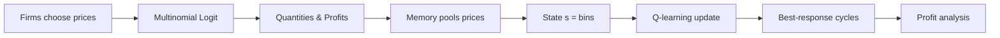

# Simplicity: An Explanatory Document

**Logic, Math, Simulations, and What Results Suggest**

---

## 1. What Is This Project?

**Simplicity** studies **repeated Bertrand competition** with **limited memory**. Two firms repeatedly choose prices. The central question: *How does coarse recall of past prices (simpler memory) affect whether firms learn to collude or compete?*

- **Bertrand competition** = firms compete on price (not quantity)
- **Repeated** = the same game is played over and over, with a discount factor
- **Limited memory** = each firm may only remember a simplified version of last period's prices (e.g., "high" vs "low" instead of exact values)
- **Q-learning** = a reinforcement learning algorithm used to model how firms learn

---

## 2. The Stage Game: Bertrand with Multinomial Logit Demand

### 2.1 Setup

Two firms \(i \in \{1, 2\}\) choose prices \(p_1\) and \(p_2\). Consumers choose according to a **multinomial logit** model: the probability of choosing firm \(i\) depends on quality minus price, scaled by substitution.

### 2.2 The Math

**Quantities (market shares):**

\[
q_i = \frac{\exp\left(\frac{q_i - p_i}{\mu}\right)}{\exp\left(\frac{q_1 - p_1}{\mu}\right) + \exp\left(\frac{q_2 - p_2}{\mu}\right)}
\]

- \(q_i\) = quality of firm \(i\)
- \(p_i\) = price of firm \(i\)
- \(\mu\) = substitution parameter (how easily consumers switch between firms)

**Profits:**

\[
\pi_i = (p_i - c_i) \cdot q_i
\]

- \(c_i\) = cost of firm \(i\)

### 2.3 Parameter Values

| Parameter | Value |
|-----------|-------|
| Quality \(q_1, q_2\) | 2.0 |
| Cost \(c_1, c_2\) | 1.0 |
| Substitution \(\mu\) | 0.25 |

### 2.4 Price Grid

Prices are discretized into **15 points** from 1.43 to 1.97:

\[
p_k = 1.43 + k \cdot \frac{1.97 - 1.43}{14}, \quad k \in \{0, 1, \ldots, 14\}
\]

So index 1 → 1.43, index 15 → 1.97. Higher indices = higher prices.

### 2.5 Intuition

- **High prices together** → less competition, higher profits (collusion)
- **Undercutting** → one firm drops price, steals share, opponent loses
- **Competitive outcome** → prices near cost, profits around **0.25** (used as benchmark)

---

## 3. Repeated Game and Learning

- **Horizon:** Infinite
- **Discount factor \(\gamma\):** 0.95 (future matters a lot)
- **Learning:** Q-learning with ε-greedy exploration
- **State:** Each firm conditions on **last period's prices** (possibly coarsened)

---

## 4. Memory and State Representation

### 4.1 The Core Idea

In principle, the state is \((p_1^{t-1}, p_2^{t-1})\) — last period's prices. But each firm may see a **coarsened** version: instead of 15×15 = 225 possible states, a firm might only distinguish, say, 2×2 = 4 states (e.g., "low/low", "low/high", "high/low", "high/high").

### 4.2 Pooling via Thresholds

**Config format:** For each player \(i\), we specify `[own_thresholds, opp_thresholds]` — lists of price-index cutpoints.

**Pooling rule:** Map a price index to a bin.

```
function POOLING(action, thresholds):
    if thresholds is empty:
        return action   // full resolution
    bin ← 1
    for each threshold t in order:
        if action > t:
            bin ← bin + 1
        else:
            break
    return bin
```

**Example:** thresholds = [2, 4, 6]
- action 1, 2 → bin 1
- action 3, 4 → bin 2
- action 5, 6 → bin 3
- action 7, ..., 15 → bin 4

### 4.3 State from Each Player's View

For player \(i\), the state is `(own_bin, opp_bin)` in the pooled space.

**Full memory:** thresholds = [1, 2, ..., 14] (or empty) → 15 bins, full resolution.

**Coarse memory examples:**

| Config | Own bins | Opp bins | Total states |
|--------|----------|----------|--------------|
| 2×2    | 2        | 2        | 4            |
| 4×4    | 4        | 4        | 16           |
| 8×8    | 8        | 8        | 64           |
| 15×15  | 15       | 15       | 225          |

**Asymmetric memory:** Player 1 might have 5×5 while Player 2 has 15×15 — they see different state spaces.

### 4.4 Diagram: State Pooling

```
PRICE INDICES:     1   2   3   4   5   6   7   8   9  10  11  12  13  14  15
                   |   |   |   |   |   |   |   |   |   |   |   |   |   |   |
thresholds [2,4,6]:|   |   |   |   |   |   |   |   |   |   |   |   |   |   |
                   v   v   v   v   v   v   v   v   v   v   v   v   v   v   v
BINS:              1   1   2   2   3   3   4   4   4   4   4   4   4   4   4
```

---

## 5. Q-Learning

### 5.1 What Is Q-Learning?

Each player \(i\) maintains \(Q_i(s, a)\) = expected discounted payoff from taking action \(a\) in state \(s\) and playing optimally thereafter.

### 5.2 Update Rule (Asynchronous)

After playing \((s, a)\), receiving payoff \(\pi_i\), and transitioning to \(s'\):

\[
Q_i(s, a) \leftarrow Q_i(s, a) + \alpha \left[ \pi_i + \gamma \max_{a'} Q_i(s', a') - Q_i(s, a) \right]
\]

- \(\alpha\) = learning rate (0.05)
- \(\gamma\) = discount factor (0.95)
- The term in brackets is the **TD error** (temporal difference).

### 5.3 Synchronous Update (Optional)

Instead of updating only the action played, update **all** actions in state \(s\) using hypothetical payoffs:

For each action \(j\):

\[
Q_i(s, j) \leftarrow Q_i(s, j) + \alpha \left[ \pi_i(p_{-i}, p^j) + \gamma \max_{a'} Q_i(s', a') - Q_i(s, j) \right]
\]

where \(p_{-i}\) is the opponent's actual price and \(p^j\) is the price for action \(j\).

### 5.4 Action Selection (ε-Greedy)

- With probability \(1 - \varepsilon\), choose \(\arg\max_a Q(s, a)\)
- With probability \(\varepsilon\), choose uniformly over all actions
- \(\varepsilon\) is derived from a temperature parameter (τ = 0.02, so ~98% greedy)

---

## 6. Pseudocode: Full Simulation

```
ALGORITHM: Train Q-Learning with Memory

INPUT: model, n_iterations, monitoring (memory config)
OUTPUT: Q[1], Q[2] (Q-tables for each player)

1. Initialize:
   - Q[i][state] ← optimistic values for each (state, action)
   - price_grid ← [1.43, 1.47, ..., 1.97]
   - last_prices ← random action indices

2. For t = 1 to n_iterations:
   a. State: s[i] ← POOLED(last_prices) for player i
   b. Actions: a[i] ← ε-GREEDY(Q[i], s[i])
   c. Prices: p[i] ← price_grid[a[i]]
   d. Payoffs: π[i] ← (p[i] - c[i]) * q[i]  (from logit formula)
   e. Next state: s'[i] ← POOLED(a)
   f. For each player i:
      - If SYNC: update Q[i](s, j) for all j using hypothetical payoffs
      - If ASYNC: update Q[i](s, a[i]) only
   g. last_prices ← a

3. Return Q[1], Q[2]
```

---

## 7. Pseudocode: Pooling (State Abstraction)

```
FUNCTION POOLING(action, thresholds):
    if thresholds is empty:
        return action
    bin ← 1
    for t in thresholds:
        if action > t:
            bin ← bin + 1
        else:
            break
    return bin

FUNCTION FULL_MONITORING(last_prices, identity, thresholds):
    if thresholds[identity] is empty:
        return (last_prices, identity)
    pooled ← [POOLING(p, thresholds[identity][i]) for i, p in last_prices]
    return (pooled, identity)
```

---

## 8. Analysis: Best-Response Cycles and Profits

### 8.1 Why Best-Response Cycles?

We don't just average profits over training. Instead, we treat the learned Q-tables as defining **best-response functions** and find **cycles** in the strategy space.

### 8.2 Algorithm: Follow the Cycles

```
FUNCTION FOLLOW_THE_CYCLES(Q, memory_dict, start=(15,15)):
    BR[s] ← argmax_a Q[s,a] for each state s
    path ← []
    (a, b) ← start   // start at highest prices (most collusive)

    while (a, b) not in path:
        path.append((a, b))
        s1 ← state viewed by P1 at (a, b)
        s2 ← state viewed by P2 at (a, b)
        a ← BR[s1]
        b ← BR[s2]

    // Find cycle from first repeat
    idx ← index of (a, b) in path
    cycle ← path[idx : -1]
    return prices in cycle
```

### 8.3 Profit Computation

1. For each run, compute best-response cycle from (15, 15)
2. For each state in the cycle, compute stage-game profits \(\pi_1, \pi_2\)
3. Average over cycle: \(\bar{\pi} = \frac{1}{2}(\bar{\pi}_1 + \bar{\pi}_2)\)
4. Average over runs (with standard error)
5. **Benchmark:** 0.25 = competitive profit level

### 8.4 Interpretation

- **Profit > 0.25** → tendency toward collusion (higher prices sustained)
- **Profit ≈ 0.25** → competitive
- **Profit < 0.25** → possibly chaotic or anti-competitive cycles

---

## 9. Simulation Batches and Configurations

### 9.1 Batch Structure

Each batch has **4 memory types**. Examples:

| Batch | P1 memory | P2 memory |
|-------|-----------|-----------|
| batch_01 | full → 7×7 → 5×5 → 4×4 | full |
| batch_05 | 5×5, 6×6, 7×7, 8×8 | 5×5 |
| batch_10 | full, 7×7, 5×5, 4×4 | 5×5 |
| batch_16 | 5×5, 6×6, 7×7, 8×8 | 2×2 |

### 9.2 Generators

- **Sync:** Synchronous Q-updates, one batch at a time
- **Async:** Asynchronous Q-updates
- **Multithreaded:** Sync, runs all 16 batches in parallel

---

## 10. What Results Suggest

### 10.1 Main Findings (Conceptual)

1. **Coarser memory can sustain collusion**  
   When both firms have limited memory (e.g., 2×2 or 4×4), they may still converge to high-price cycles. Simpler strategies can be easier to coordinate on.

2. **Asymmetry matters**  
   When one firm has full memory and the other has coarse memory, outcomes depend on the configuration. Sometimes the coarse firm "simplifies" the game in a way that facilitates collusion; sometimes it creates instability.

3. **Best-response cycles capture learned behavior**  
   By starting at (15, 15) and following best responses, we see where the learned strategies settle. Cycles that stay at high prices → collusion; cycles that drop to low prices → competition.

4. **Benchmark 0.25**  
   Profits above 0.25 indicate above-competitive outcomes; the extent to which they exceed 0.25 reflects the degree of implicit collusion.

### 10.2 Visualization Outputs

- **Profit grinds:** Bar charts of mean profit (with error bars) for each memory type per batch
- **Best-response state reports:** State matrix (letters for pooled states) + BR price pairs for P1 and P2

---

## 11. Summary Tables

### Core Formulas

| Quantity | Formula |
|----------|---------|
| Quantity (logit) | \(q_i = \frac{\exp((q_i-p_i)/\mu)}{\sum_j \exp((q_j-p_j)/\mu)}\) |
| Profit | \(\pi_i = (p_i - c_i) q_i\) |
| Q-update | \(Q \leftarrow Q + \alpha (\pi + \gamma \max Q' - Q)\) |
| Price grid | \(p_k = 1.43 + k \cdot 0.0386\), \(k \in \{0,\ldots,14\}\) |

### Key Parameters

| Parameter | Symbol | Value |
|-----------|--------|-------|
| Players | \(p\) | 2 |
| Discount | \(\gamma\) | 0.95 |
| Learning rate | \(\alpha\) | 0.05 |
| Grid size | | 15 |
| Temperature | \(\tau\) | 0.02 |
| Quality | \(q\) | 2.0 |
| Cost | \(c\) | 1.0 |
| Substitution | \(\mu\) | 0.25 |

---

## 12. Diagrams

### 12.1 Overview Flow (Mermaid)



### 12.2 Pooling Example (thresholds [2, 4, 6])

```
Price index:  1  2  3  4  5  6  7  8  9 10 11 12 13 14 15
              |  |  |  |  |  |  |  |  |  |  |  |  |  |  |
              +--+  +--+  +--+  +------------------------+
              | 1  | 2  | 3  |           4              |
              +----+----+----+---------------------------+
              BIN 1  BIN 2  BIN 3         BIN 4
```

### 12.3 State Space: Full vs Coarse

```
FULL MEMORY (15×15 = 225 states)     COARSE MEMORY (2×2 = 4 states)
┌─┬─┬─┬─┬─┬─┬─┬─┬─┬─┬─┬─┬─┬─┬─┐     ┌─────────┬─────────┐
│ │ │ │ │ │ │ │ │ │ │ │ │ │ │ │     │ Low/Low │ Low/High│
├─┼─┼─┼─┼─┼─┼─┼─┼─┼─┼─┼─┼─┼─┼─┤     ├─────────┼─────────┤
│ │ │ │ │ │ │ │ │ │ │ │ │ │ │ │     │High/Low │High/High│
├─┼─┼─┼─┼─┼─┼─┼─┼─┼─┼─┼─┼─┼─┼─┤     └─────────┴─────────┘
... (15×15 grid)                    Each cell = many price pairs
└─┴─┴─┴─┴─┴─┴─┴─┴─┴─┴─┴─┴─┴─┴─┘     lumped together
```

### 12.4 Best-Response Cycle (Concept)

```
Start at (15, 15) = highest prices
        │
        ▼
   ┌─────────┐     BR₁(s)     ┌─────────┐
   │ (a,b)   │ ─────────────► │ (a',b)  │
   └─────────┘                └────┬────┘
        ▲                          │ BR₂(s)
        │                          ▼
   ┌────┴────┐                ┌─────────┐
   │ (a',b') │ ◄───────────── │ (a',b') │
   └─────────┘     BR₁(s)     └─────────┘
        │
        └── Cycle repeats → average profit over cycle
```

### 12.5 Profit Interpretation

```
Profit
   │
   │     ┌────────────────── Collusive region
   │     │  (prices high, π > 0.25)
   │     │
0.25├ - - - - - - - - - - - - - - - - - Competitive benchmark
   │     │
   │     │  (prices near cost)
   │     └────────────────── Competitive region
   │
   └──────────────────────────────────► Memory coarseness
        Fine                         Coarse
```

---

*Document generated for the Simplicity project. See `execution.md` for how to run simulations and `analysis/visualize_batches.py` for visualization.*
